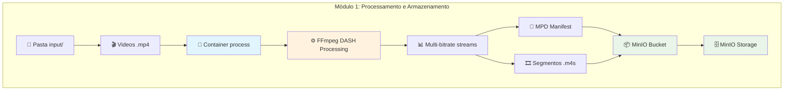
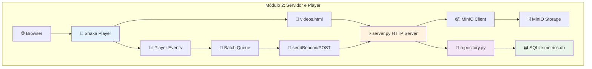
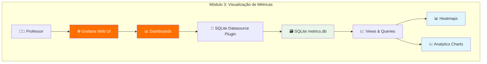
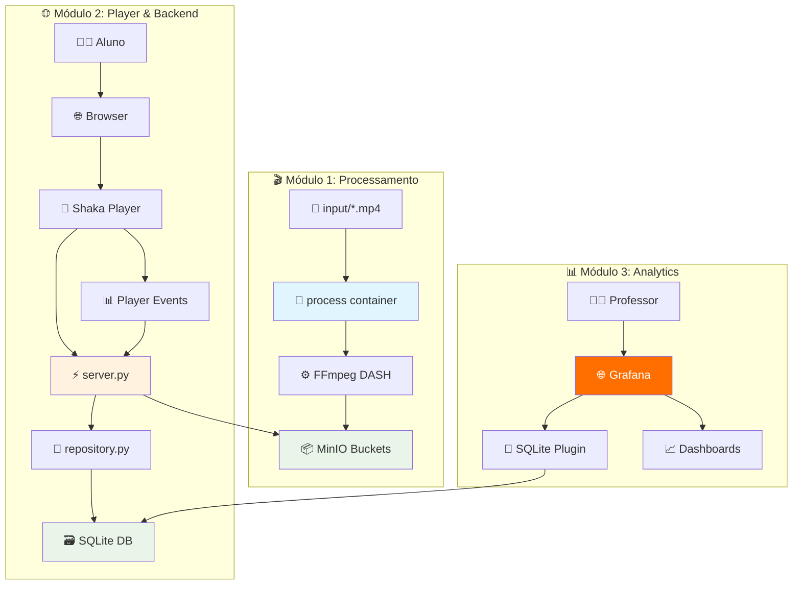
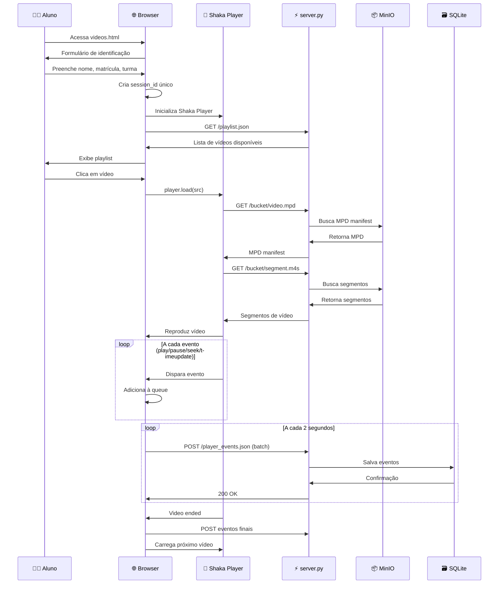
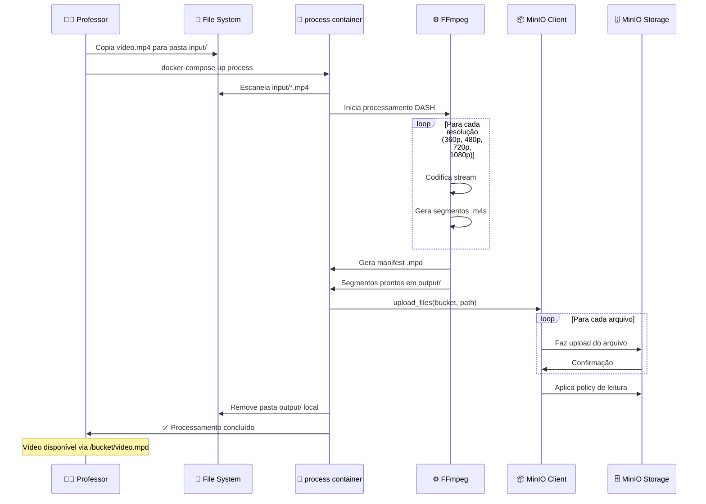
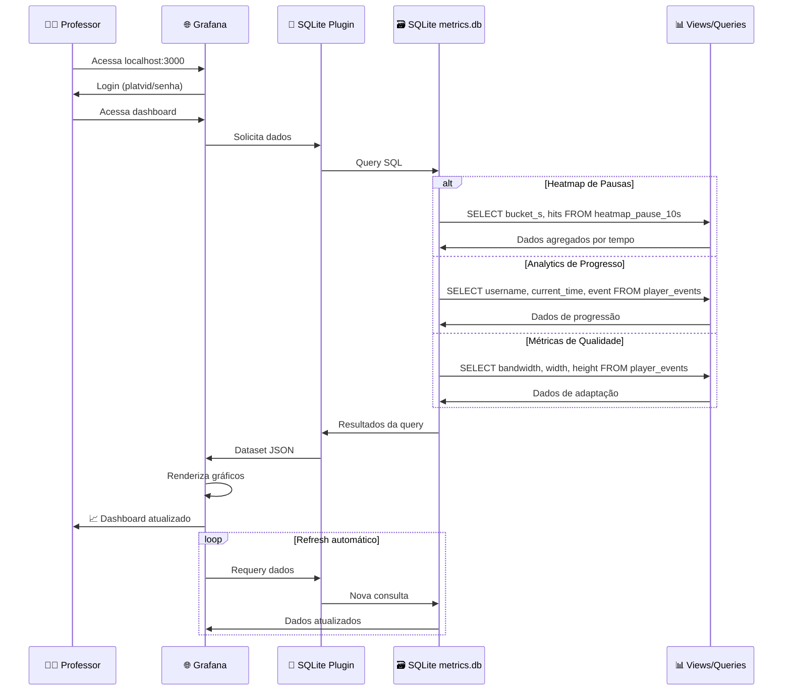

# Diagramas da Arquitetura - Plataforma de Vídeos UFRJ

## 1. Módulo 1: Input, FFmpeg e MinIO

## 2. Módulo 2: Backend, Shaka Player e SQLite

## 3. Módulo 3: Grafana

## 4. Arquitetura Completa Interconectada

## 5. Diagrama de Sequência: Aluno Assistindo Vídeo

## 6. Diagrama de Sequência: Professor Subindo Vídeo

## 7. Diagrama de Sequência: Professor Visualizando Métricas

## Tecnologias por Módulo

### Módulo 1 - Processamento
- **Docker**: Containerização
- **FFmpeg**: Transcodificação DASH
- **MinIO**: Object Storage S3-compatible
- **Python**: Scripts de automação

### Módulo 2 - Player & Backend
- **Shaka Player**: Player DASH no navegador
- **Python HTTP Server**: Backend de proxy e API
- **SQLite**: Banco de dados de eventos
- **JavaScript**: Frontend e coleta de métricas

### Módulo 3 - Analytics
- **Grafana**: Plataforma de visualização
- **SQLite Plugin**: Datasource para Grafana
- **SQL Views**: Agregações pré-calculadas
